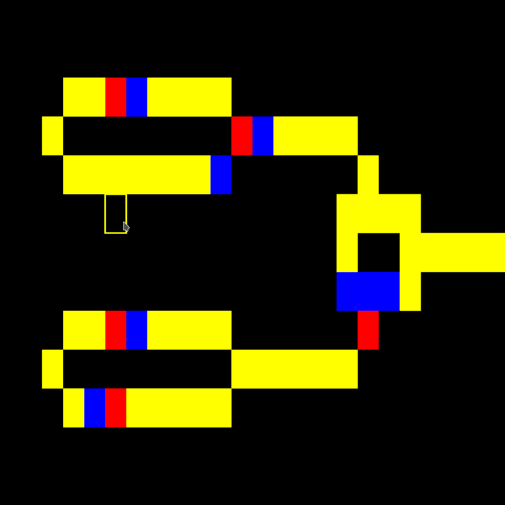

# WireWorld, try this app [here!](https://gitmanik.dev/wireworld)

A Rust implementation of the [Wireworld](https://en.wikipedia.org/wiki/Wireworld) cellular automaton. Wireworld is a simple but powerful model often used to simulate digital logic circuits in a 2D grid.

## Overview

On startup, the program attempts to load the initial grid configuration from a file called **grid.txt**. If this file is missing or invalid, the program will create a blank 50×50 grid.

The simulation opens in a window. You can hover your mouse over any cell, and clicking the **left mouse button** will change that cell to the currently selected drawing state (e.g., Conductor, Head, Tail, or Empty). You can also drag and drop a file directly into the window to load its contents as the new grid state.

## Controls

- **Z** – Paint cell as **Conductor**  
- **X** – Paint cell as **Electron Head**  
- **C** – Paint cell as **Electron Tail**  
- **V** – Paint cell as **Empty**  
- **P** – Print the current grid state to the console  
- **S** – Save the current grid state to a file **current.txt**  
- **Spacebar** – Pause or unpause the simulation  

## File Format (`grid.txt`)

The file must contain exactly **W×H** characters (where `W` is the grid width and `H` is the grid height). Each character corresponds to a single cell’s state:

- **`.`** (dot) – Empty space  
- **`>`** (greater-than sign) – Electron Head  
- **`<`** (less-than sign) – Electron Tail  
- **`-`** (hyphen) – Conductor  

If the file is missing or contains invalid characters, the program defaults to a blank 50×50 grid.

## How to Run

1. Clone or download the repository.  
2. Make sure you have [Rust](https://www.rust-lang.org/tools/install) installed.  
3. Open a terminal in the project directory.  
4. Run the application with:
   ```bash
   cargo run --release
5. Or, if you want to build WASM
```bash
cargo build --target wasm32-unknown-unknown --release
wasm-bindgen --target web --no-typescript --out-dir ./web ./target/wasm32-unknown-unknown/release/WireWorld.wasm
```

### Used libraries
* Nannou
* wasm-bindgen
